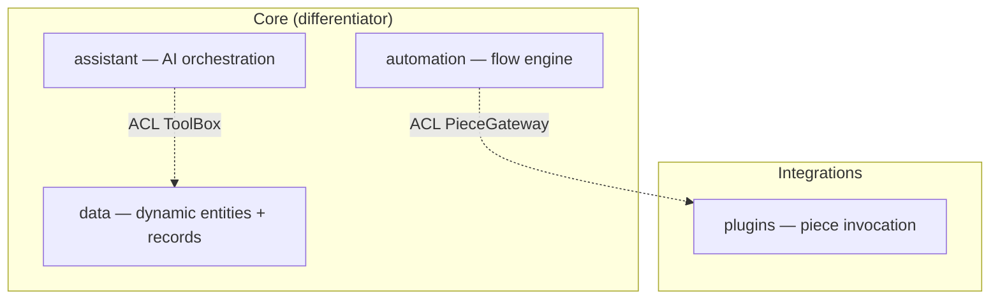

# Architecture

`run-hex` is AEX Run expressed as **Ports & Adapters + DDD bounded contexts**,
modeled on adequa-all. Two views:

- **Macro** (context map): which context owns what, who depends on whom, via ACL.
- **Micro** (the hexagon): one context as domain at the centre, ports around it,
  adapters outside.

## Macro: context map

Rules (enforced by `dependency-cruiser`):

- A context never imports another context's files.
- Cross-context needs are declared as **out-ports** (`ToolBox`, `PieceGateway`)
  and fulfilled in `main/container.ts` by routing to the other context's in-port.
- `domain` and `application` import no npm and no `platform`.

## Micro: the two core hexagons

- [hexagon-data.md](hexagon-data.md) — dynamic entity in classic DDD.
- [hexagon-automation.md](hexagon-automation.md) — pure decider + effect interpreter.

## The unifying pattern

Both core contexts (and `assistant`) implement
[`Decider`](../../src/shared/kernel/Decider.ts): a pure `decide(state) -> Effect[]`
and `evolve(state, event) -> State`, driven by a thin imperative shell that
performs effects through ports. Determinism gives free crash-resume by replaying
recorded events through `evolve` (see `FlowInterpreter.resume`).
