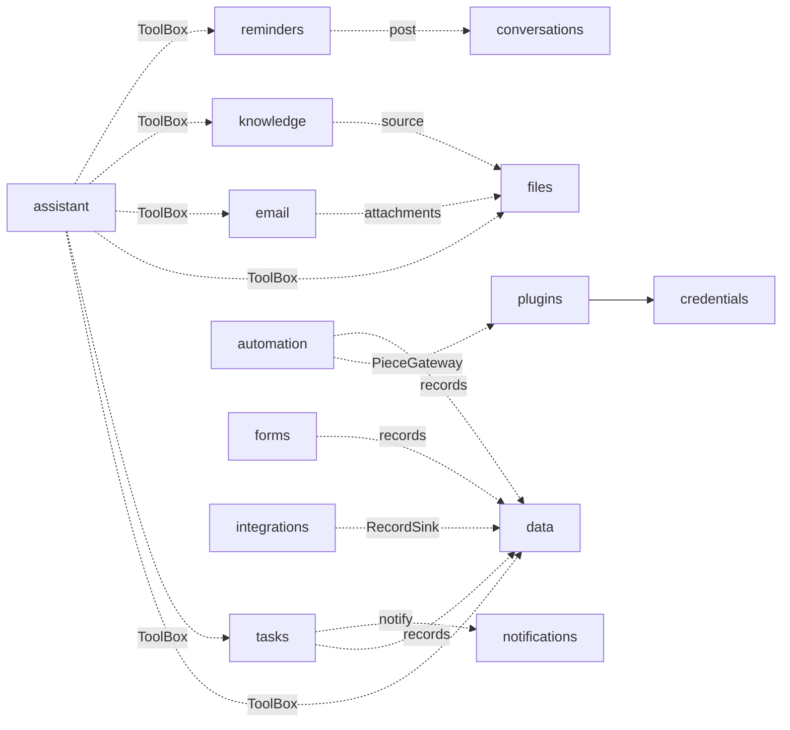

# Context Map — full AEX Run backend

The complete bounded-context decomposition of AEX Run (23 tRPC routers, ~154
procedures, 9 BullMQ workers, the AI layer, flow engine, email, files). Each
context owns its tables and talks to others only via ACL out-ports fulfilled in
`main/container.ts`.

| Context | Owns (tables) | Routers / surface | Core domain logic | Status |
|---|---|---|---|---|
| **identity** | users, sessions, accounts, verifications, twoFactors, loginAttempts | auth, users, profile | password policy, HIBP check, lockout sliding-window, roles/bans, invites | planned |
| **conversations** | conversations, conversationMembers, messages | conversations, messages | membership/visibility, DM dedup, read state, reactions, soft-delete | planned |
| **assistant** | (agents, skills) | agents, skills | AI tool loop (decider), agent/skill resolution, MCP tool wiring, subagents | ✅ core built; extend |
| **data** | entities, entityRecords, savedViews, userViewPreferences, geocodeCache | entities, viewPreferences, geocode | dynamic schema (EntityDefinition), RecordSchema validation, formula, CAS, saved views | ✅ built; extend |
| **tasks** | tasks, taskLogs, taskAssignees | tasks, reminders(create) | task lifecycle state machine, assignee state, budget-enforced runner, snooze/ack | planned |
| **automation** | flows, flowVersions, flowRuns, flowFolders | flows | flow DSL decider, executors (piece/code/loop/router), versioning, runs | ✅ core built; extend |
| **plugins** | plugins, pluginStore | plugins | piece registry, install lifecycle, project/flow store | ✅ core built; extend |
| **credentials** | credentials | credentials | OAuth2 state machine, auto-refresh, resolution precedence, token cache | planned |
| **integrations** | integrations | integrations | REST/oauth2/webhook config, Bling sync, webhook signature | planned |
| **files** | files, fileShares | files | folder tree, sharing/ACL, public links, AI indexing trigger | planned |
| **email** | emailAccounts, emails, emailAttachments, emailLabels, mailAccountMembers | emails | SMTP send, IMAP sync + thread reconstruction, folders/labels, AI draft, crypto | planned |
| **knowledge** | knowledge, messageEmbeddings | knowledge | scope rules, embedding/RAG, file-sourced KB | planned |
| **forms** | forms, formSubmissions | forms | public token, entity-linked submission → data record | planned |
| **reminders** | reminders | reminders | schedule/fire/cancel, delayed-job keying | planned |
| **notifications** | notifications, notificationPreferences | notifications | unread surface, email digest idempotency | planned |
| **settings** | settings | settings | setup wizard, company config (transaction-script tier) | planned |
| **audit** | auditLog | auditLog | append-only trail, keyset pagination (transaction-script tier) | planned |

Cross-context ACL edges (out-ports fulfilled in main):

Platform (shared infra, not a context): `db` (Drizzle + pgvector schema),
`http` (Fastify + tRPC), `queue` (BullMQ/Redis), `ws`, `ai-runtime`
(Claude Agent SDK), `config`, `events`. Frontend (`apps/web`) is a driving
adapter over the tRPC in-ports.

Tiering (cost control): **core** contexts (data, automation, assistant, tasks,
email, credentials) get full hexagon + rich domain; **generic** ones (settings,
audit, geocode, view-preferences, notifications) are thin transaction-scripts.
