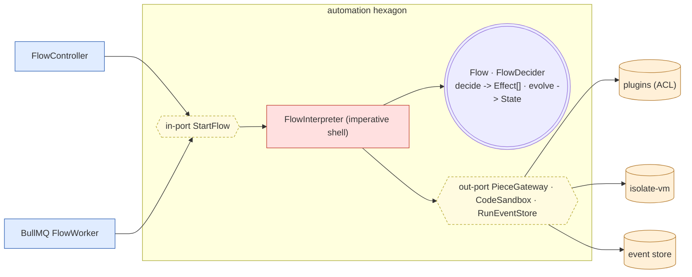

# Hexagon — `automation` (pure decider + effect interpreter)

A flow engine interprets a user-defined graph and runs it. What is **inherently
impure**: piece calls (network), code blocks (arbitrary user JS), triggers
(time), durable run state. What is **pure**: graph validity, control-flow
decisions (routing, variable interpolation), the next-step transition.

Resolution: **Functional Core / Imperative Shell**. The core never performs an
effect; it returns effects as **data**.

- [`FlowDecider.ts`](../../src/contexts/automation/domain/FlowDecider.ts) — pure
  `decide`/`evolve`. The router branch is decided here with no IO.
- [`Effect.ts`](../../src/contexts/automation/domain/Effect.ts) — effects as data.
- [`FlowInterpreter.ts`](../../src/contexts/automation/application/use-cases/FlowInterpreter.ts)
  — the only place with IO. `resume()` rebuilds state by replaying the event log
  through `evolve` (no effect re-performed) — deterministic crash recovery.
- The **one irreducible impurity** (user code) is a single port,
  [`CodeSandbox`](../../src/contexts/automation/application/ports/out/CodeSandbox.ts);
  sandboxing/limits are the adapter's job.
- Cross-context: pieces are invoked via the
  [`PieceGateway`](../../src/contexts/automation/application/ports/out/PieceGateway.ts)
  ACL, bridged to the `plugins` in-port in `main/container.ts`.
