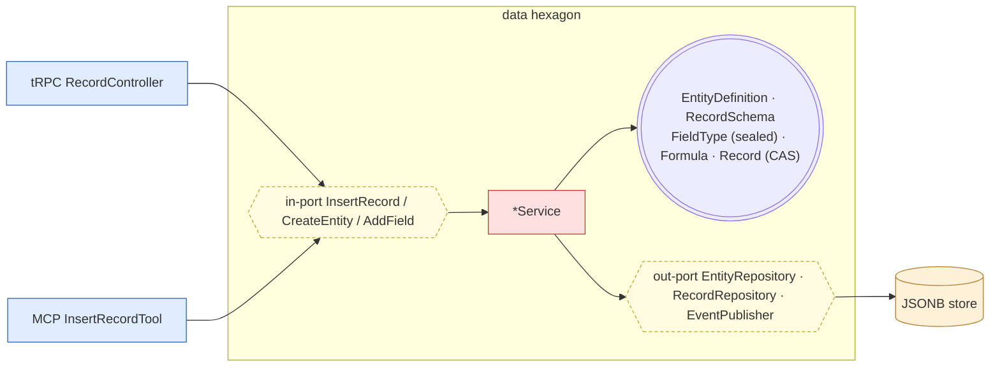

# Hexagon — `data` (dynamic entity in classic DDD)

The tension: users define entities (schema) at runtime, but classic DDD wants
compile-time aggregates with invariants in code. Resolution: **there are two
sub-models**, not one.

- **Meta domain (schema design).** `EntityDefinition` is a rich aggregate with
  real invariants: unique field names, a formula may only reference existing
  fields, you cannot drop a field a formula depends on. Pure, classic.
- **Instance domain (data entry).** `Record` is a *generic* aggregate whose
  invariants are **parameterized by** a `RecordSchema` (the compiled projection
  of the definition). `schema.validate(data)` is the Specification pattern: the
  schema is data, the interpreter is static domain code — exactly like a regex
  engine or a type-checker is pure even though its input is runtime data.

Key files:

- [`FieldType.ts`](../../src/contexts/data/domain/FieldType.ts) — the 28 field
  types as a **closed set of strategy VOs**. A new type is a code change, never
  user data.
- [`Formula.ts`](../../src/contexts/data/domain/Formula.ts) +
  [`FormulaEvaluator.ts`](../../src/contexts/data/domain/FormulaEvaluator.ts) —
  pure parser + tree-walking evaluator.
- [`RecordSchema.ts`](../../src/contexts/data/domain/RecordSchema.ts) — validates
  + computes formula fields.
- [`Record.ts`](../../src/contexts/data/domain/Record.ts) — optimistic-concurrency
  (Version CAS); persistence-as-JSON is invisible to it.
- Relations: cross-aggregate existence is checked in
  [`InsertRecordService`](../../src/contexts/data/application/use-cases/InsertRecordService.ts),
  by id, never inside the aggregate.
- Reads: [`ListRecords`](../../src/contexts/data/application/queries/ListRecords.ts)
  is CQRS — straight to a query adapter, no domain.
